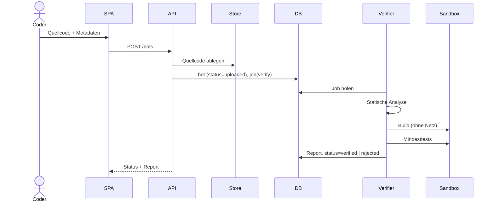
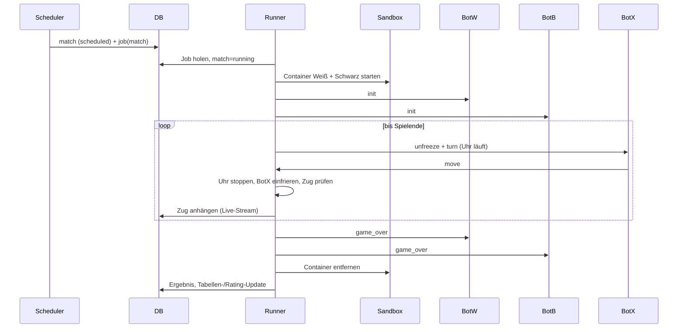

# Abläufe zwischen den Komponenten

## 1. Bot-Upload bis Spielberechtigung

Erst `verified` erlaubt die Anmeldung zu Ligen und Turnieren. Details: [verifikation.md](../komponenten/verifikation.md).

## 2. Ein Match

Details: [match-runner.md](../komponenten/match-runner.md), [bot-protokoll.md](../komponenten/bot-protokoll.md).

## 3. Saison-Zyklus

1. Scheduler erkennt fälligen Saisonstart (Konfiguration der Liga).
2. Einfrieren der Teilnehmerlisten: Auf-/Absteiger der Vorsaison, neu angemeldete Bots in die unterste Stufe.
3. Paarungen erzeugen (Round-Robin), Match-Jobs mit Priorität und frühestem Startzeitpunkt anlegen.
4. Runner arbeiten die Jobs ab; nach jedem Match wird die Tabelle fortgeschrieben.
5. Nach dem letzten Match: Tabelle finalisieren, Auf-/Abstieg berechnen, Saison `finished`.

## 4. Live-Verfolgung

- Runner schreibt jeden Zug sofort in das Match-Dokument.
- Web-API verteilt Änderungen über den Live-Kanal an abonnierte Clients (Quelle: MongoDB Change Streams oder Pub/Sub, siehe [backend-api.md](../komponenten/backend-api.md)).
- Der Viewer nutzt für Live und Replay dieselbe Zugliste.

## 5. Mensch gegen Bot

1. SPA fordert Spiel gegen Bot X an → API legt `match` (Typ `human`) und Job an.
2. Runner startet nur den Bot-Container; Gegenseite ist der `HumanPlayer`-Adapter.
3. Züge des Menschen laufen SPA → API → Runner; der Bot ist währenddessen eingefroren.
4. Leerlauf-Timeout und Begrenzung gleichzeitiger Spiele pro Nutzer schützen die Kapazität.

## 6. Lokaler Bot gegen Web-API

1. Lokaler Bot startet mit Transport `remote` und API-Token.
2. API legt `match` (Typ `remote`) an; Runner startet den Server-Gegner in der Sandbox.
3. Der lokale Bot wird über den `RemoteBotPlayer`-Adapter angebunden; der Server prüft jeden Zug wie üblich.

Details: [lokale-entwicklung.md](../komponenten/lokale-entwicklung.md).
