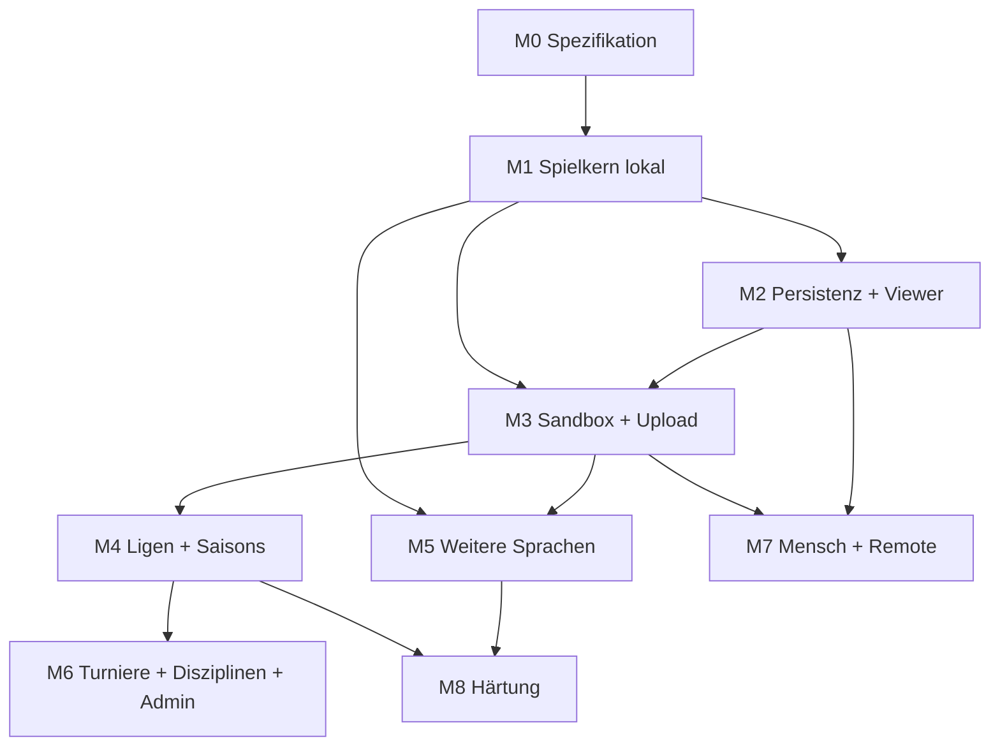

# Roadmap

## Prioritätsstufen

| Stufe | Bedeutung |
|-------|-----------|
| P0 | Kernfunktion: ohne das gibt es kein Spiel zwischen zwei Bots, das gespeichert und angesehen werden kann |
| P1 | Nötig für den Betrieb mit fremden Bots (Sicherheit, Upload, Wettbewerbe) |
| P2 | Ausbau der geforderten Funktionen (weitere Sprachen, Turniere, Mensch/Remote) |
| P3 | Härtung und Komfort |

## Abhängigkeiten

## Meilensteine

### M0 – Spezifikation und Gerüst (P0)

| Inhalt | Ergebnis |
|--------|----------|
| Monorepo-Struktur, Coding-Standards, CI-Grundgerüst | Leere Pipelines laufen grün |
| Protokoll-Schema (`spec/protocol`) | Versioniertes JSON-Schema + Beispielnachrichten |
| Kanonische Bot-API (`spec/api`) | Sprachneutrale Definition aller Funktionen |
| Testvektoren (`spec/testvectors`) | Perft, Regeln, FEN/UCI |
| Klärung O1, O2 | Entscheidung dokumentiert |

Abnahme: Spezifikationen sind vollständig genug, dass ein SDK ohne Rückfragen implementierbar ist.

### M1 – Spielkern lokal (P0)

| Inhalt | Ergebnis |
|--------|----------|
| Referee-Kern (Stellung, Zugprüfung, Endbedingungen, Uhr) | Als wiederverwendbares Paket |
| Python-SDK: Schachkern, Bot-Basisklasse, Log-Bibliothek, `stdio`/`tcp`-Transport | Besteht alle Testvektoren |
| Lokale Arena (CLI) | Zwei lokale Bots spielen eine vollständige Partie, PGN-Ausgabe |
| Referenzbots (Zufall, Material) | Gegner und Vorlagen |
| Debug-Workflow | Bot aus der IDE mit Haltepunkten, Uhr abschaltbar |

Abnahme: Zwei Python-Bots spielen lokal regelkonform inklusive Zeitüberschreitung, illegalem Zug und Absturz als Endgründe.

### M2 – Persistenz, API, Viewer (P0)

| Inhalt | Ergebnis |
|--------|----------|
| MongoDB-Schema für `matches`, `bots`, `jobs` | Indizes, Migrationsmechanik |
| Runner als Dienst mit Job-Queue (noch ohne Sandbox, nur vertrauenswürdige Bots) | Spiele werden aus Jobs ausgeführt und gespeichert |
| Flask-API: Partien lesen, Bots lesen | OpenAPI-Vertrag |
| SPA-Grundgerüst + Partie-Viewer mit Geschwindigkeiten | Gespeicherte Partien ansehbar |
| Deployment-Pipeline (Build, Registry, Deploy, Staging) | Stack kommt per GitHub Actions auf den Server |

Abnahme: Eine vom Admin ausgelöste Partie zweier Referenzbots läuft auf dem Server, liegt in der DB und ist im Browser vollständig abspielbar.

### M3 – Sandbox, Verifikation, Upload, Auth (P1)

| Inhalt | Ergebnis |
|--------|----------|
| Sandbox-Images Python (Build/Run), Härtung, Einfrieren, Limits | Bot läuft isoliert |
| Statischer Analyzer Python | Regelwerk als Konfiguration |
| Verifikations-Pipeline mit Mindesttests und Report | Statusmodell umgesetzt |
| Auth: Invite, Login, Rollen, Sessions | Coder und Admin |
| Upload-UI, „Mein Bereich“, Bot-Versionen/Abstammung | Coder kann Bot hochladen und Status verfolgen |
| Sicherheitstests (Ausbruchsversuche als Testbots) | Negativ-Suite in CI |
| Klärung O6, O7, O9 | Entscheidung dokumentiert |

Abnahme: Ein eingeladener Nutzer lädt einen Python-Bot hoch; bösartige Testbots (Netz, Datei, Fork-Bombe, Speicher, Endlosschleife) werden abgelehnt oder in der Sandbox folgenlos beendet.

### M4 – Ligen und Saisons (P1)

| Inhalt | Ergebnis |
|--------|----------|
| Disziplin-Modell (zunächst Zeitkontrollen) | Konfigurierbar |
| Liga-Konfiguration, Saisons, Round-Robin, Tabellen, Tiebreaks, Auf-/Abstieg | Vollständiger Saisonzyklus |
| Scheduler (Zeitsteuerung, Prioritäten, Entzerrung, Neuansetzen) | Automatischer Betrieb |
| Rating | Je Bot und Disziplin |
| UI: Ligen, Tabellen, Spielplan, Bot-Profil mit voller Historie | Einsehbar |
| Live-Kanal für laufende Spiele | Viewer aktualisiert sich |
| Minimaler Adminbereich (Liga anlegen, Bot sperren, Jobs sehen) | Betrieb möglich |
| Klärung O4, O5, O8 | Entscheidung dokumentiert |

Abnahme: Zwei aufeinanderfolgende Saisons laufen ohne manuellen Eingriff durch, inklusive Auf-/Abstieg und neu einsteigendem Bot.

### M5 – Weitere Sprachen (P2)

Pro Sprache dasselbe Paket: SDK (Schachkern, API, Log, Transporte), Testvektoren, Sandbox-Images, Analyzer, Vorlagenprojekt, Aufnahme in den Kreuztest.

| Reihenfolge | Sprache | Begründung der Position |
|-------------|---------|-------------------------|
| 1 | JavaScript | Ähnliche Analyseform wie Python (AST), schlankes Run-Image |
| 2 | Java | Bytecode-Analyse gut abgrenzbar |
| 3 | C# | Ähnlich zu Java, Analyzer über Compiler-Plattform |
| 4 | C++ | Aufwendigster Analyzer, Build als größte Angriffsfläche |

Die Reihenfolge ist nach Aufwand/Risiko sortiert und frei änderbar; die Sprachen sind untereinander unabhängig und nach M3 jederzeit parallelisierbar.

Abnahme je Sprache: Alle Vektoren bestanden, Bot der Sprache gewinnt/verliert regulär gegen Bots aller bereits unterstützten Sprachen, Negativ-Suite bestanden.

### M6 – Turniere, Ressourcen-Disziplinen, voller Adminbereich (P2)

| Inhalt | Ergebnis |
|--------|----------|
| Turnierformate (Round-Robin, Schweizer, K.-o.), Wiederholung, Anmeldung | Konfigurierbar |
| Ressourcenlimitierte Disziplinen (Speicher, CPU, Dateigröße), Sprachfaktoren/-sockel | Durchgesetzt und geprüft bei Anmeldung |
| Adminbereich vollständig (Nutzer, Invites, Disziplinen, Ligen, Turniere, Overrides, Neuprüfung, Audit-Log) | Alles ohne DB-Zugriff verwaltbar |
| Einzelspiele (auch Version gegen Version) | Ansetzbar durch Besitzer/Admin |

### M7 – Mensch gegen Bot, lokaler Bot gegen Web-API (P2)

| Inhalt | Ergebnis |
|--------|----------|
| `HumanPlayer`-Adapter, Spiel-UI | Partie im Browser gegen gewählten Bot |
| `RemoteBotPlayer`-Adapter, `remote`-Transport in den SDKs, API-Tokens | Lokaler Bot spielt gegen Server-Bot |
| Kapazitäts- und Missbrauchsgrenzen | Konfigurierbar |
| Klärung O3 | Entscheidung dokumentiert |

Kann vor M6 gezogen werden; hängt nur von M2/M3 ab.

### M8 – Härtung und Betrieb (P3)

| Inhalt |
|--------|
| Stärkere Isolation je nach O9 |
| Monitoring, Alarme, Backup-/Restore-Probe |
| Lasttests (parallele Spiele, Zeitmessgenauigkeit) |
| Tabellen-Neuberechnung und Reparaturwerkzeuge |
| Vollständige Autoren-Doku je Sprache, API-Referenz aus `spec/api` generiert |
| Datenschutz-/Löschfunktionen für Accounts |

## Querschnitt (ab M0 durchgehend)

- CI als Merge-Gate, Testvektoren für jedes SDK
- Dokumentation der Entscheidungen in [00_entscheidungen.md](00_entscheidungen.md)
- Protokoll- und SDK-Versionierung von Beginn an

## Kritischer Pfad zur Kernfunktion

`M0 → M1 → M2` liefert „zwei Bots spielen, Partie ist gespeichert und ansehbar“. `M3 → M4` macht daraus einen Betrieb mit fremden Bots und automatischen Ligen. Alles Weitere erweitert Breite (Sprachen, Formate, Spielarten), nicht den Kern.
