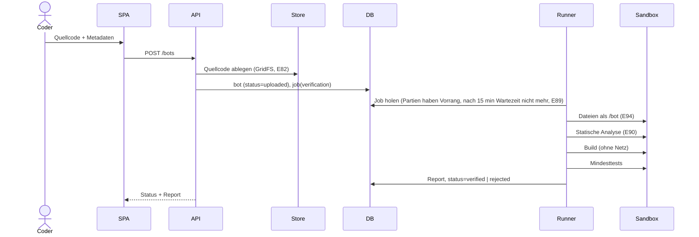
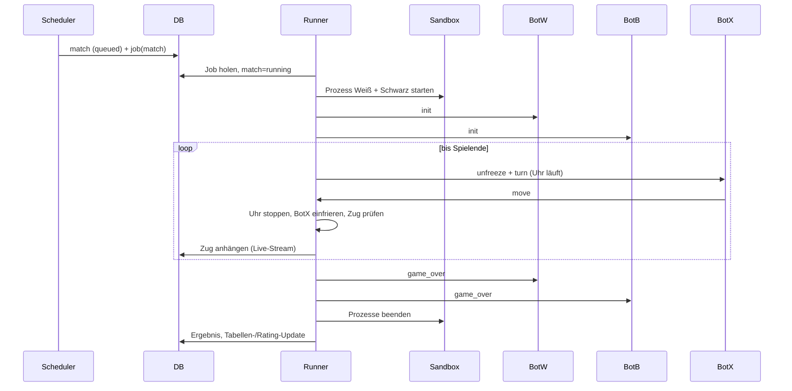

# Abläufe zwischen den Komponenten

## 1. Bot-Upload bis Spielberechtigung

Den Build gibt es bei Python nicht. Erst `verified` erlaubt die Anmeldung zu Ligen und Turnieren. Details: [verifikation.md](../komponenten/verifikation.md).

## 2. Ein Match

Details: [match-runner.md](../komponenten/match-runner.md), [bot-protokoll.md](../komponenten/bot-protokoll.md).

## 3. Saison-Zyklus

1. Scheduler erkennt fälligen Saisonstart (Konfiguration der Liga).
2. Einfrieren der Teilnehmerlisten: Auf-/Absteiger der Vorsaison, neu angemeldete Bots in die unterste Stufe.
3. Paarungen erzeugen (Round-Robin) und mit der Priorität des Wettbewerbs in die Queue stellen.
4. Der Runner arbeitet die Queue lückenlos ab (nächstes Spiel startet, sobald eines endet); nach jedem Match werden Tabelle und geschätzte Startzeiten fortgeschrieben.
5. Nach dem letzten Match: Tabelle finalisieren, Auf-/Abstieg berechnen, Saison `finished`.

## 4. Live-Verfolgung

- Runner schreibt jeden Zug sofort in das Match-Dokument.
- Web-API verteilt Änderungen über den Live-Kanal an abonnierte Clients (Quelle: MongoDB Change Streams oder Pub/Sub, siehe [backend-api.md](../komponenten/backend-api.md)).
- Der Viewer nutzt für Live und Replay dieselbe Zugliste.

## 5. Mensch gegen Bot

1. Ein beliebiger Besucher (auch ohne Account, E11) fordert ein Spiel gegen Bot X an → API legt `match` (Typ `human`) und einen Job der Art `play` an und gibt den Sitz-Token einmal aus (E113).
2. Die SPA öffnet die WebSocket-Verbindung zum Gateway und nimmt mit dem Token ihren Sitz ein (gateway-v1, E112).
3. Der Play-Runner (`runner-play`) holt den Job, startet nur den Bot-Prozess in der Sandbox und verbindet den Sitz über das Relay; Gegenseite ist der `HumanPlayer`-Adapter (M7 Schritt 2).
4. Züge des Menschen laufen SPA → Gateway → Play-Runner; der Bot ist währenddessen eingefroren.
5. Grenzen gleichzeitiger Spiele (pro IP und gesamt) und Abbruch bei langer Abwesenheit schützen die Kapazität ([gateway.md](../komponenten/gateway.md)).

## 6. Lokaler Bot gegen Web-API

1. Lokaler Bot startet mit Transport `remote` und API-Token; das SDK legt über die API `match` (Typ `remote`) an und erhält den Sitz-Token.
2. Das SDK verbindet sich per WebSocket mit dem Gateway und spricht nach `joined` das Bot-Protokoll v1.
3. Der Play-Runner startet den Server-Gegner in der Sandbox und bindet den lokalen Bot als `RelayPlayer` an; der Referee prüft jeden Zug wie üblich (E112, E113).

Details: [lokale-entwicklung.md](../komponenten/lokale-entwicklung.md).
