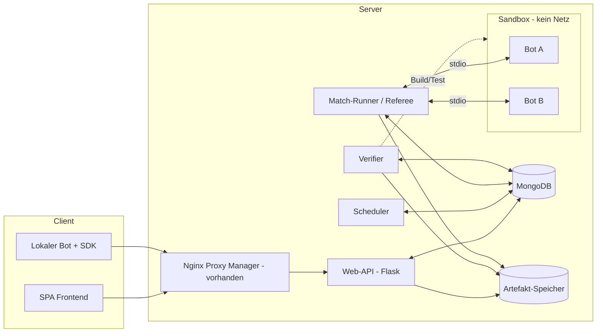

# Systemübersicht

## Komponenten



| Komponente | Verantwortung | Detail |
|------------|---------------|--------|
| SPA | Anzeige, Viewer, Upload-UI, Admin-UI, Mensch-gegen-Bot | [frontend.md](../komponenten/frontend.md) |
| Web-API (Flask) | REST + Live-Kanal, Auth, Rollen, Validierung; schreibt Jobs, führt **nie** Bot-Code aus | [backend-api.md](../komponenten/backend-api.md) |
| MongoDB | Persistenz aller Stammdaten, Partien, Tabellen, Jobs | [datenmodell.md](../komponenten/datenmodell.md) |
| Artefakt-Speicher | Quellcode-Uploads, Build-Ergebnisse, Bot-Logs (Volume oder GridFS) | [verifikation.md](../komponenten/verifikation.md) |
| Scheduler | Erzeugt Saisons, Turniere, Paarungen und Match-Jobs nach Konfiguration | [ligen-turniere.md](../komponenten/ligen-turniere.md) |
| Match-Runner | Referee: autoritativer Spielzustand, Uhren, Start/Stopp der Bot-Prozesse | [match-runner.md](../komponenten/match-runner.md) |
| Verifier | Statische Analyse, Build, Mindesttests für hochgeladene Bots | [verifikation.md](../komponenten/verifikation.md), [statische-analyse.md](../komponenten/statische-analyse.md) |
| Sandbox (nsjail) | Isolierte Ausführung je Bot-Prozess | [sandbox.md](../komponenten/sandbox.md) |
| Schachkern (C++) | Einzige Regelimplementierung; genutzt von Referee, Arena und allen SDKs | [sdk-api.md](../komponenten/sdk-api.md) |
| SDKs (×5) | Binding auf den Kern, Bot-API, Debug-Logging, Protokoll-Client | [sdk-api.md](../komponenten/sdk-api.md) |
| Lokale Arena / Remote-Client | Entwicklung und Debugging ohne Server bzw. gegen die Web-API | [lokale-entwicklung.md](../komponenten/lokale-entwicklung.md) |

## Vertrauensgrenzen

| Zone | Enthält | Regel |
|------|---------|-------|
| Öffentlich | SPA, Web-API | Kann keine Prozesse starten, kein Bot-Code |
| Intern vertrauenswürdig | Scheduler, Runner, Verifier, DB | Nicht von außen erreichbar; nur Runner/Verifier dürfen Sandbox-Prozesse starten |
| Nicht vertrauenswürdig | Bot-Code (auch beim **Kompilieren**), Uploads, Eingaben lokaler Bots | Nur in der Sandbox; jede Ausgabe wird als feindliche Eingabe behandelt |

Kernprinzipien:

- **Referee ist autoritativ.** Jeder Zug wird serverseitig geprüft; ein manipuliertes SDK im Bot-Prozess bringt keinen Vorteil.
- **Bots kommunizieren nie direkt.** Die Sprachunabhängigkeit entsteht ausschließlich über das [Bot-Protokoll](../komponenten/bot-protokoll.md).
- **Ein Spieler-Interface, mehrere Adapter.** Der Referee kennt nur „Spieler“: Sandbox-Bot, Remote-Bot (Web-API), Mensch (Browser). Damit teilen sich Liga-Spiele, Remote-Spiele und Mensch-gegen-Bot dieselbe Spiellogik.
- **Alles Konfigurierbare liegt in der DB** (Disziplinen, Ligen, Turniere, Queue, Limits) und ist über die Website einstellbar (E13).
- **Eine Regelimplementierung.** Referee, Arena und alle SDKs nutzen denselben C++-Kern.

## Repo-Struktur (Monorepo)

```
SchachBotManager/
├── docs/                    Konzept und Spezifikationen
├── spec/                    Protokoll-Schema, kanonische API-Definition, Testvektoren (Perft, FEN, Remis)
├── backend/                 Flask-API
├── frontend/                SPA
├── services/
│   ├── runner/              Match-Runner / Referee
│   ├── verifier/            Pipeline + Analyzer je Sprache
│   └── scheduler/
├── sdk/
│   ├── core/                C++-Schachkern + C-Schnittstelle
│   ├── python/  cpp/  java/  csharp/  javascript/   Bindings
├── tools/
│   ├── arena/               Lokale Arena (CLI)
│   └── spec-check/          Prüft alle JSON-Dateien unter spec/ (CI)
├── sandbox/                 nsjail-Konfiguration und Laufzeitverzeichnisse je Sprache
├── deploy/                  docker-compose, Dockerfiles, Beispiel-Umgebungsdatei
└── .github/workflows/
```
