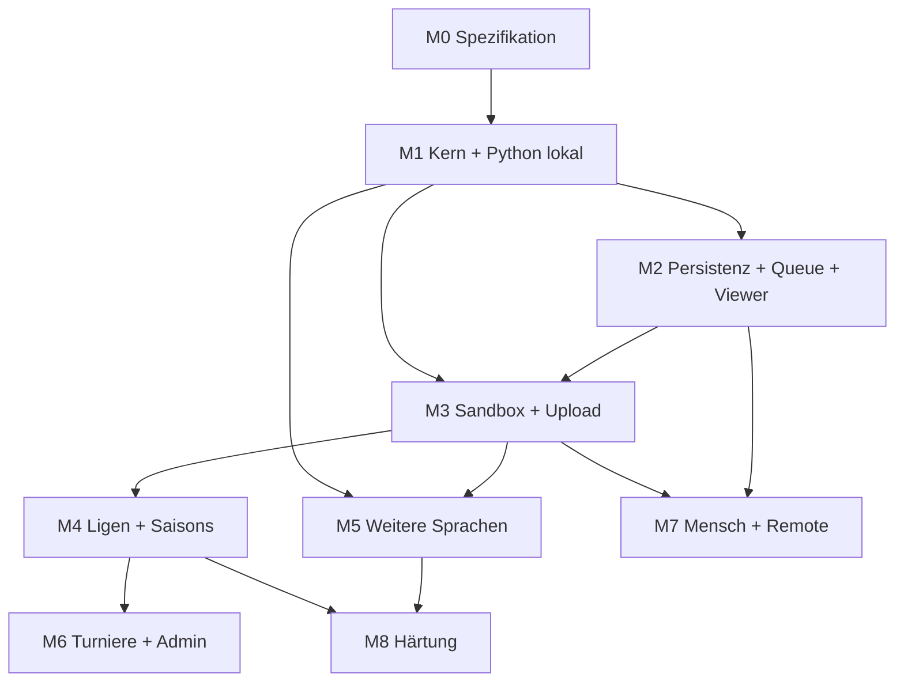

# Roadmap

Stand: Revision 4 (gemeinsamer C++-Kern, nsjail im Container, Spiel-Queue; Ressourcenlimits zurückgestellt)

## Prioritätsstufen

| Stufe | Bedeutung |
|-------|-----------|
| P0 | Kernfunktion: ohne das gibt es kein Spiel zwischen zwei Bots, das gespeichert und angesehen werden kann |
| P1 | Nötig für den Betrieb mit fremden Bots (Sicherheit, Upload, Wettbewerbe) |
| P2 | Ausbau der geforderten Funktionen (weitere Sprachen, Turniere, Mensch/Remote) |
| P3 | Härtung und Komfort |

## Abhängigkeiten

## Meilensteine

### M0 – Spezifikation und Gerüst (P0)

| Inhalt | Ergebnis |
|--------|----------|
| Monorepo-Struktur, Coding-Standards, CI-Grundgerüst | Leere Pipelines laufen grün |
| Protokoll-Schema (`spec/protocol`) | Versioniertes JSON-Schema + Beispielnachrichten |
| Kanonische Bot-API (`spec/api`) inklusive Rohzugriff | Sprachneutrale Definition; Feldnummerierung, Zug- und Figurenkodierung festgelegt |
| C-Schnittstelle des Kerns | Funktionsliste, Fehlercodes, Regeln für Handles |
| Testvektoren (`spec/testvectors`) | Perft, Regeln, FEN/UCI, API-Erwartungswerte |

Abnahme: Spezifikationen sind vollständig genug, dass Kern und ein Binding ohne Rückfragen implementierbar sind.

### M1 – Schachkern und Python lokal (P0)

| Inhalt | Ergebnis |
|--------|----------|
| C++-Kern mit C-Schnittstelle | Besteht alle Perft- und Regelvektoren |
| Python-Binding: `Board` (hohe Ebene + Rohzugriff), `Bot`-Callback, `Clock`, Log-Bibliothek, `stdio`/`tcp`-Transport | Besteht die API-Vektoren |
| Vorkompilierte Wheels über CI (Windows, Linux, macOS) | `pip install` genügt als Setup |
| Referee-Kern (Uhr in Wanduhrzeit, Zugprüfung, Endbedingungen) auf demselben C++-Kern | Wiederverwendbares Paket |
| Lokale Arena (CLI, im Python-Paket) | Zwei lokale Bots spielen eine vollständige Partie, PGN-Ausgabe |
| Referenzbots (Zufall, Material) | Gegner und Vorlagen |
| Debug-Workflow | Bot aus der IDE mit Haltepunkten, Uhr abschaltbar |

Abnahme: Auf einem frischen Rechner reichen `pip install` und ein Skript, um zwei Python-Bots regelkonform gegeneinander spielen zu lassen, inklusive Zeitüberschreitung, illegalem Zug und Absturz als Endgründe.

### M2 – Persistenz, Queue, API, Viewer (P0)

| Inhalt | Ergebnis |
|--------|----------|
| MongoDB-Schema für `matches`, `bots`, `jobs`, `settings` | Indizes, Migrationsmechanik |
| Runner als Dienst mit Spiel-Queue (noch ohne Sandbox, nur die Referenzbots, E72) | Spiele laufen lückenlos nacheinander und werden gespeichert |
| Flask-API: Partien, Bots, Queue lesen (öffentlich) | OpenAPI-Vertrag unter `spec/web/` (E73) |
| React-SPA: Grundgerüst, Partie-Viewer mit Geschwindigkeiten, Queue-Ansicht mit geschätzten Startzeiten | Gespeicherte Partien ansehbar |
| Deployment: Compose-Stack, SSH-Deploy aus GitHub Actions, Anbindung an Nginx Proxy Manager über `local-web` | Stack kommt per GitHub Actions auf den Server und ist unter der Subdomain erreichbar |
| Zweisprachigkeit (Deutsch/Englisch) im SPA-Grundgerüst | Übersetzungsdateien von Beginn an |

Abnahme: Mehrere in die Queue gestellte Partien laufen direkt hintereinander, liegen in der DB und sind im Browser ohne Login vollständig abspielbar; der Stack läuft auf dem Server unter der Subdomain. Die Partien stellen in M2 Tests und Entwicklungswerkzeuge ein; dass der Admin sie auf dem Server über die Website einstellt, gehört zur Abnahme von M3 (E71).

### M3 – Sandbox, Verifikation, Upload, Auth (P1)

| Inhalt | Ergebnis |
|--------|----------|
| `runner`-Container mit erweiterten Rechten (führt auch die Verifikation aus, E81), nsjail-Konfiguration und Laufzeitverzeichnis Python, feste Schutzgrenzen, Einfrieren über cgroup | Bot läuft isoliert |
| Statischer Analyzer Python inklusive Bibliotheks-Whitelist | Regelwerk als Konfiguration |
| Verifikations-Pipeline mit Mindesttests und Report | Statusmodell umgesetzt |
| Auth: Invite, Login, Rollen, Sessions | Coder und Admin |
| Admin-Seite zum Ansetzen von Partien (aus M2, E71) | Partien auf dem Server ohne DB-Zugriff |
| Upload mehrerer Quelldateien und Datendateien bis 1 MB, `load_data` im SDK | Mehrdatei-Bots möglich |
| Upload-UI, „Mein Bereich“, Bot-Versionen/Abstammung, Quellcode nur für Besitzer/Admin | Coder kann Bot hochladen und Status verfolgen |
| Negativ-Suite (Netz, Datei, Fork-Bombe, Speicher, Endlosschleife, übergroße Ausgabe) | In CI |

Reihenfolge in vier Schritten, jeder für sich ausgerollt (E80): (1) Auth und Admin-Seite zum Ansetzen von Partien – umgesetzt (E83–E85); (2) nsjail im Runner und Negativ-Suite – umgesetzt und auf dem Server geprüft (E86–E88); (3) Analyzer, Verifikation und Upload für Python – umgesetzt (E89–E94); (4) „Mein Bereich“, Versionen und Reports – umgesetzt (E95–E98).

Abnahme: Ein eingeladener Nutzer lädt einen Python-Bot hoch; bösartige Testbots werden abgelehnt oder in der Sandbox folgenlos beendet. Der Admin stellt auf dem Server über die Website mehrere Partien ein, die direkt hintereinander laufen und im Browser abspielbar sind (aus M2 verschoben, E71).

### M4 – Ligen und Saisons (P1)

| Inhalt | Ergebnis |
|--------|----------|
| Disziplin-Modell (Zeitkontrollen), über die Website einstellbar | Konfigurierbar |
| Liga-Konfiguration, Saisons, Round-Robin, Tabellen, Tiebreaks, Auf-/Abstieg | Vollständiger Saisonzyklus |
| Queue-Logik: Prioritäten, Wechsel zwischen Wettbewerben, Pausieren, Neuansetzen, Laufzeitschätzung | Mehrere Wettbewerbe teilen sich die Queue |
| Rückzug eines Bots (kampflose Siege, markiert; weniger Absteiger; Nachrücker) | Regel E17 umgesetzt |
| Rating | Je Bot und Disziplin |
| UI: Ligen, Tabellen, Spielplan, Bot-Profil mit voller Historie | Einsehbar |
| Live-Kanal für laufende Spiele | Viewer aktualisiert sich |
| Adminbereich Teil 1 (Disziplinen, Ligen, Queue-Steuerung, Bot sperren) | Betrieb ohne DB-Zugriff |

Abnahme: Zwei aufeinanderfolgende Saisons laufen ohne manuellen Eingriff durch, inklusive Auf-/Abstieg, neu einsteigendem Bot und einem während der Saison zurückgezogenen Bot.

### M5 – Weitere Sprachen (P2)

Pro Sprache: Binding auf den Kern, Paket mit eingebetteten Binaries, API- und Protokolltests, Laufzeitverzeichnis + seccomp-Whitelist, Analyzer mit Bibliotheks-Whitelist, Vorlagenprojekt, Aufnahme in den Kreuztest. Die Schachregeln selbst müssen nicht erneut implementiert werden.

| Reihenfolge | Sprache | Begründung der Position |
|-------------|---------|-------------------------|
| 1 | C++ | Binding entfällt praktisch (direkter Zugriff auf den Kern); der Analyzer ist der aufwendigste, kann aber früh beginnen |
| 2 | JavaScript | Analyseform ähnlich zu Python (AST); nativer Addon als neue Bindungsart |
| 3 | Java | Bytecode-Analyse gut abgrenzbar; Laufzeit mit größerer seccomp-Whitelist |
| 4 | C# | Ähnlich zu Java |

Die Reihenfolge ist nach Aufwand und Abhängigkeiten sortiert und frei änderbar; die Sprachen sind untereinander unabhängig.

Abnahme je Sprache: Alle API-Vektoren bestanden, Bot der Sprache spielt regulär gegen Bots aller bereits unterstützten Sprachen, Negativ-Suite bestanden, Setup auf frischem Rechner mit einem Paketbefehl.

### M6 – Turniere, voller Adminbereich (P2)

| Inhalt | Ergebnis |
|--------|----------|
| Turnierformate (Round-Robin, Schweizer, K.-o.), Wiederholung, Anmeldung | Konfigurierbar |
| Adminbereich vollständig: jede Einstellung über die Website (E13), Nutzer, Invites, Overrides, Neuprüfung, Audit-Log | Kein Parameter mehr nur in Dateien |
| Einzelspiele (auch Version gegen Version) | Ansetzbar durch Besitzer/Admin |

### M7 – Mensch gegen Bot, lokaler Bot gegen Web-API (P2)

| Inhalt | Ergebnis |
|--------|----------|
| `HumanPlayer`-Adapter, Spiel-UI für Gäste ohne Account | Partie im Browser gegen gewählten Bot |
| `RemoteBotPlayer`-Adapter, `remote`-Transport in den Bindings, API-Tokens | Lokaler Bot spielt gegen Server-Bot |
| Kapazitäts- und Missbrauchsgrenzen (pro IP, gesamt), einstellbar | Schutz der Queue |

Kann vor M6 gezogen werden; hängt nur von M2/M3 ab.

### M8 – Härtung und Betrieb (P3)

| Inhalt |
|--------|
| Monitoring, Alarme, Backup-/Restore-Probe |
| Messung der Zeitgenauigkeit unter Fremdlast, Feinabstimmung von CPU-Gewichtung und Toleranz |
| Tabellen-Neuberechnung und Reparaturwerkzeuge |
| Vollständige Autoren-Doku je Sprache, API-Referenz aus `spec/api` generiert |
| Datenschutz-/Löschfunktionen für Accounts |

### Zurückgestellt (ohne Meilenstein)

| Inhalt |
|--------|
| Konfigurierbare Ressourcenlimits und ressourcenlimitierte Disziplinen (E23, O17) |

## Querschnitt (ab M0 durchgehend)

- CI als Merge-Gate; Kernvektoren und Binding-Tests
- Entscheidungen in [00_entscheidungen.md](00_entscheidungen.md) nachführen
- Protokoll- und SDK-Versionierung von Beginn an

## Kritischer Pfad zur Kernfunktion

`M0 → M1 → M2` liefert „zwei Bots spielen, Partie ist gespeichert und ansehbar“. `M3 → M4` macht daraus einen Betrieb mit fremden Bots und automatischen Ligen. Alles Weitere erweitert Breite (Sprachen, Formate, Spielarten), nicht den Kern.
